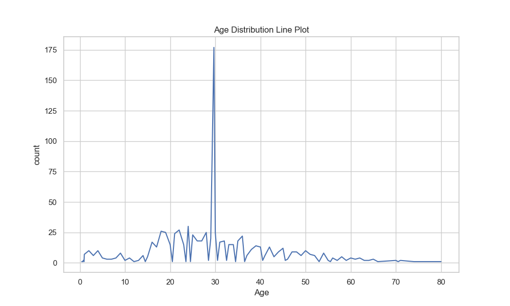
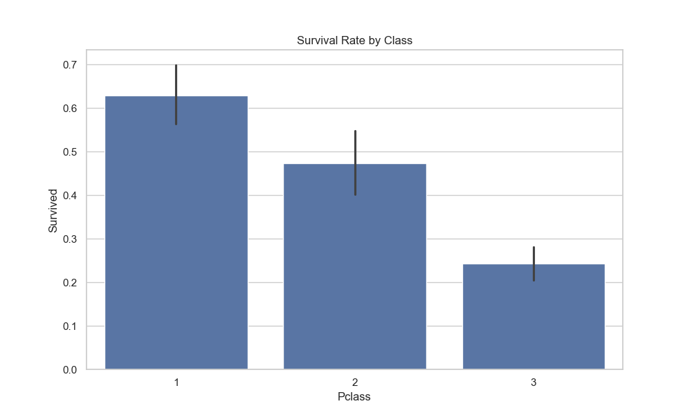
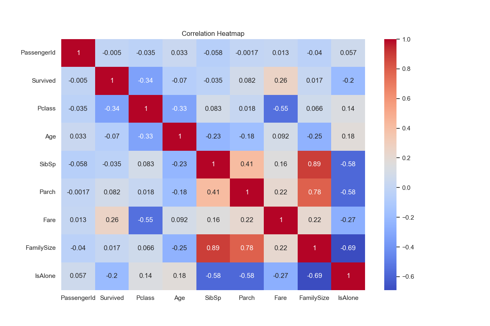

# ML Internship - Week 2: Data Handling with NumPy & Pandas

This repository contains the tasks completed during the second week of my Machine Learning internship.

## Project Structure
- **Task_2_1_Numpy/**: Exercises covering NumPy basics, arrays, and mathematical operations.
- **Task_2_2_Pandas/**: Comprehensive data cleaning and exploration on the Titanic dataset.
- **screenshots/**: Proof of environment setup and code execution.

## Tech Stack
- **Python**
- **NumPy** (for numerical computations)
- **Pandas** (for data manipulation)
- **Matplotlib/Seaborn** (for data visualization)

## Key Learning Outcomes
1. Data cleaning techniques (handling missing values, encoding).
2. Efficient array processing using NumPy.
3. Feature engineering and data visualization.

## Task 2.3 – Data Visualization with Matplotlib & Seaborn

In this task, I used the cleaned Titanic dataset to create multiple data visualizations for better exploratory data analysis.

### Visualizations Created
- Line plot (Age distribution)
- Scatter plot (Age vs Fare)
- Histogram (Passenger class distribution)
- Bar chart (Survival rates)
- Box plot (Fare by passenger class)
- Violin plot (Age by gender)
- Correlation heatmap
- Pair plot for numerical features

- Below are some example visualizations generated in Task 2.3:

Other plots (scatter, box, violin, pair plot) are available in the visualizations folder.

All visualizations were generated using **Matplotlib and Seaborn** and saved as PNG files.

### Key Learnings
- Choosing appropriate plots for different data types
- Understanding relationships between numerical features
- Visual interpretation of survival patterns in the Titanic dataset

*Created by [Hassan Raza]*
